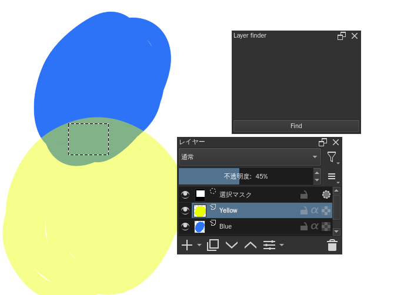
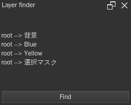

# Krita-layer-finder

A docker to find layers that colorizes a part of or the full selection.

## Installation
1. Clone this project
2. Copy [`layerfinder.desktop`](layerfinder.desktop) and the [`layerfinder/`](layerfinder/) directory into the `pykrita` directory in your Krita resource folder. See [the document](https://docs.krita.org/en/reference_manual/resource_management.html#resource-management) for its location.
3. Copy the `actions/lockall.action` file into the `actions` directory in the resource folder.

## Usage
1. Make a selection.

2. Press the `Find` button.
3. The layers that colorizes the selection will be listed.

## License
All files in this repository are licensed under GNU General Public License v3.0. See [LICENSE](LICENSE).
